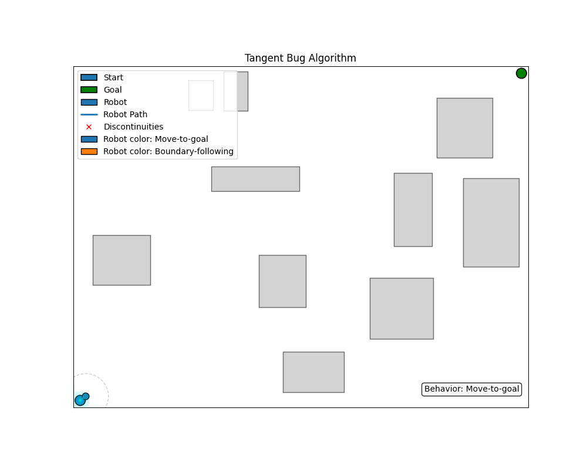
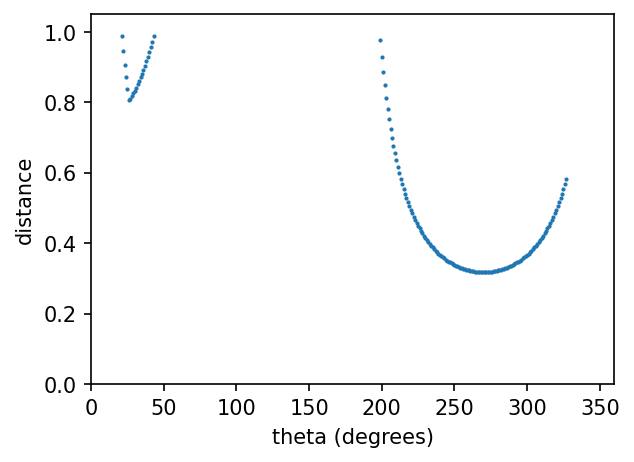

# Tangent Bug 

Questo progetto mostra l'esecuzione dell’algoritmo **Tangent Bug** in un ambiente 2D con ostacoli rettangolari generati in modo casuale.  
Viene generata una **simulazione animata** del robot e un **grafico** con lo *scan* del sensore (angolo θ → distanza).

---


## Descrizione dell’algoritmo Tangent Bug

Il Tangent Bug alterna due comportamenti principali:

1. **Move-to-goal**
   - Esegue una scansione a 360° e calcola i **punti di discontinuità** $O_k$.
   - Se il goal è visibile, si muove verso il goal.
   - Altrimenti si dirige verso il punto $O_k$ che minimizza l’euristica
     $$h_k(q) = d(q, O_k) + d(O_k, \text{goal})$$
   - Passa al *boundary following* quando la minima $h_k(q)$ inizia ad aumentare.

2. **Boundary-following**
   - Segue il bordo dell’ostacolo mantenendo una distanza desiderata.
   - Confronta:
     - $d_{\text{reach}}$: distanza più corta tra l’ostacolo che in quel momento blocca la vista verso il goal e il goal stesso
     - $d_{\text{followed}}$: distanza più corta tra l’ostacolo che il robot sta seguendo e il goal
   - Ritorna a *move-to-goal* quando **$d_{\text{reach}} < d_{\text{followed}}$** (oppure quando il goal viene raggiunto).


---

## Struttura del progetto

```
.
├─ tb/
│  ├─ __init__.py
│  ├─ sim.py          # entrypoint: run_simulation()
│  ├─ robot.py        # logica del robot 
│  ├─ geometry.py     # ostacoli + funzioni geometriche 
│  ├─ plotting.py     # utility di disegno 
│  └─ utils.py        # costanti/aiuti (seed, formattazioni)
├─ main.py          
├─ requirements.txt
└─ README.md
```

---

## Requisiti

- Python **3.9+**
- Dipendenze Python:
  - `matplotlib`
  - `numpy`
  - `pillow` 

Installa tutto con:

```bash
pip install -r requirements.txt
```

---

## Esecuzione

```bash
python main.py
```
---

## Output dell’esecuzione

1. **Finestra di simulazione**  
   - Start (blu), Goal (verde)  
   - Robot che **cambia colore** a seconda del comportamento  
     *(blu = move-to-goal, arancione = boundary-following)*  
   - Path blu, discontinuità segnate con “X” rosse  
   - Badge in basso a destra con il **comportamento corrente**

2. **Grafico θ → distanza**  
   - Asse X: **θ** in gradi (0–360)  
   - Asse Y: **distanza** misurata dal LIDAR  

3. **File salvati automaticamente nella cartella "media"**
   - `tangent_bug_sim.gif` – animazione della simulazione  
   - `plot.png` – grafico finale θ → distanza

> I nomi file e i parametri (es. FPS della GIF) si possono modificare in `tb/sim.py` dentro `run_simulation()`.

---

## Demo

**Simulazione percorso**

  


**Grafico θ → distanza**

  
---


# Documentazione tecnica
## Moduli principali

### `geometry.py` — ambiente e ostacoli

**Classe `Obstacle`**  
Rappresenta un rettangolo: `(x_min, y_min, x_max, y_max)`.

Metodi chiave:
- `get_patch() -> matplotlib.patches.Rectangle`  
  Utility per disegno.
- `contains_point(p: tuple[float,float]) -> bool`
- `intersects(other: Obstacle, buffer=0.1) -> bool`  
  Intersezione con margine (utile per generazione mappa).
- `get_closest_point_on_boundary(q) -> (x,y)`  
  Proietta il punto `q` sul bordo più vicino, con gestione corretta se `q` è interno.
- `intersect_ray(origin, angle_rad) -> (t, (ix,iy), self) | (None, None, None)`  
  Intersezione raggio‑rettangolo (ritorna distanza parametrica `t`, punto d’impatto e
  riferimento all’ostacolo).
- `is_within_range(robot_pos, max_range) -> bool`
- `get_corners_in_range(robot_pos, max_range) -> list[(x,y)]`  
  Angoli dell’ostacolo che rientrano nel range sensore (euristica per discontinuità).


### `robot.py` — modello del robot 

**Classe `Robot`**

Attributi principali:
- `position: (float,float)` — posizione corrente.
- `goal: (float,float)` — posizione del goal.
- `robot_radius: float` — raggio per collisioni.
- `max_range: float` — raggio del sensore.
- `path: list[(x,y)]` — storico posizioni per disegno.
- `current_behavior: str` — `"move_to_goal"` o `"boundary_following"`.
- `followed_obstacle: Optional[Obstacle]` — ostacolo attualmente seguito.
- `follow_direction: int` — verso di percorrenza del bordo (+1 o −1).
- `d_reach, d_followed: float` — distanze usate per la condizione di switch.
- `m_point: Optional[(x,y)]` — punto per metrica followed.
- `previous_min_heuristic_dist: float` — tracking di $$\min_k h_k(q)$$ nel comportamento 1.

Metodi:

- **Collisione e movimento**
  - `check_collision(next_pos, obstacles) -> bool`  
    Verifica robot vs rettangoli.
  - `move_robot_step(target_pos, obstacles, step_size=0.30) -> bool`  
    Sposta il robot verso `target_pos`. Aggiorna `position` e `path`.

- **Sensing**
  - `sense_environment(obstacles, resolution_deg=1) -> (dap, discontinuities)`  
    Esegue uno sweep 360°: per ogni angolo trova la prima intersezione con gli ostacoli.
    Ritorna:
    - `dap`: lista di tuple `(angle_deg, dist, hit_point | None, obstacle_ref | None)`
    - `discontinuities`: punti candidati $$O_k$$.  

  - `is_goal_reachable(dap) -> bool`  
    Verifica se lungo la direzione `q to goal` lo sweep non trova impatti più vicini del goal.

- **Euristiche e FSM (Tangent Bug)**
  - `calculate_heuristic_distance(O_k) -> float`  
   $$h_k(q) = d(q,O_k) + d(O_k,goal)$$
  - `move_to_goal_behavior(obstacles) -> str`  
    - Calcola `dap`, discontinuità e `d_reach`.
    - Se il goal è visibile, prova a muoversi direttamente. Se collide, entra in boundary.
    - Se il goal **non** è visibile: seleziona $$O_k$$ che minimizza $$h_k$$; se $$\min h_k$$ peggiora rispetto allo step precedente, **switch** a boundary.
    - Ritorna lo stato `"move_to_goal" | "boundary_following" | "stuck" | "goal_reached"`.
  - `boundary_following_behavior(obstacles) -> str`  
    - Aggiorna `d_reach` e `d_followed`.  
    - Controlla condizione **\( d_{reach} < d_{followed} \)** ⇒ torna a move‑to‑goal.


### `sim.py` — loop di simulazione + export media

Funzione: **`run_simulation()`**

Responsabilità:
- Genera una mappa casuale di rettangoli (`Obstacle`) evitando sovrapposizioni. Start e goal sono posizionati in punti opposti della mappa.
- Crea figure `matplotlib` per l'ambiente.
- Esegue il loop (max 2000 step):
  - Aggiorna rays, discontinuità, path, marker del robot e badge comportamento.
  - Registra i frame con `PillowWriter` per **tangent_bug_sim.gif**.
- A fine simulazione:
  - Crea il grafico **θ (deg) vs distanza**.
  - Salva il PNG **plot.png** nella cartella `media/`.

### Parametri utili (modificabili in `run_simulation()`)

- Mappa/ostacoli: `num_obstacles`, `min_obs_size`, `max_obs_size`, `max_attempts`
- Robot/sensore: `robot_radius`, `sensing_range`
- Export: `gif_path`, `png_path`, `gif_fps`
